# Creative Commons Release 'em
An educational card game loosely based on [Texas Hold 'em poker](https://en.wikipedia.org/wiki/Texas_hold_%27em)
 to teach Creative Commons licensing.

## License
See the [LICENSE file](LICENSE.md)

## Objective 
Each players goal is to use a combination of the cards they hold (their “Copyright” cards), and the shared cards on the table (the “Commons”) to create a Creative Commons license for a scenario.

## You will need

 * Players: 3-8 per table
 * Play time: 45 mins - 1 hour, quick game could be played in as little as 20 mins.
 * Deck of playing cards (or custom [Creative Commons Release'em playing cards](https://www.tohatoha.org.nz/2018/12/tohatoha-releases-poker-style-card-game-to-teach-creative-commons-licensing/)) OR [print your own](assets/creative-commons-release-em-game.pdf).
* Some [scenarios](scenarios.csv) to create licenses for.
 
### Cards 
Each of the 4 Creative Commons license elements replace the suits on a standard deck of playing cards.
 * Spades: Attribution (BY)
 * Hearts: ShareAlike (SA)
 * Diamonds: NoDerivatives (ND)
 * Clubs: NonCommercial (NC)
 * Joker: CC0/Public domain (depending on your jurisdiction)

When playing a round of this game, cards are worth the number of points shown on the front of the cards (2-10), face cards (J,Q,K) are all worth *10 points* and the Ace is worth *20 points*.

### Scenarios
See the [scenarios bank](scenarios.csv): feel free to use and add new scenarios to this CSV via pull request or in our [shared Google sheet](https://docs.google.com/spreadsheets/d/1sZRhvWbr1faFr6BXxOfeqT22qy5N7HRLZ4WCVYtR0Mg/edit?usp=sharing). We suggest jotting down new scenarios that come up while talking to participants as you play.

## Setting up a game
 1. Select a dealer.
 2. Dealer shuffles the cards and deals 2 cards per player face down (the players “Copyright” cards, only they can look at these) and 3 cards face up in a line on the table (the shared “Commons” cards that everyone can use).
 3. The dealer reads out scenario to the players.
 4. Decide which player takes their turn first (we suggest who ever most recently reused something with a Creative Commons licence or simply the player to the left of the dealer).

 
## How to Play

At all times players are free (and encouraged) to talk about the scenario with the others on the table and discuss what licence might be the best used. The scenario will hint at which licence elements are most relevant.

  1. Each player takes turns checking the cards in their hand and those on the table to see if they can combine the Creative Commons elements to create a licence for the scenario. Don’t reveal your Creative Commons licence until the end of the round.
 2. During a turn, each player can discard 1 or both of the cards in their hand and draw new ones in order to try to:
    - get the cards needed to make the license; or
    - get higher scoring cards (cards are worth the value shown on the card 2-10, J,Q,K are also worth 10 points and the Ace is worth 20 points).
 3. Once everyone has had a first turn to discard and draw new cards, the dealer will deal 1 more card face up on the table into “Commons” cards.
 4. Players then take another turn deciding to discard and draw new cards as above.
 5. Once all players have had a second turn, the dealer will again deal 1 more card face up on the table into the “Commons” cards.
 6. Players take a final turn to discard and draw new cards if they wish.
 7. Once all remaining players have had their turn, each player will then use the cards in their hand and the "Commons" cards to create the licence they think is correct.
 8. Each player should tell the group why they think the selected licence is the best choice and how it applies to the scenario.
 9. The dealer will reveal the correct answer for the scenario, or in a conference setting this might be shown on the screen.
 10. The player/s with the correct licence and the highest scoring cards win the hand (and gets a point!).
 11. The dealer collects all the cards and a new scenario is started.

## A example round
### Scenario
Bob is a political cartoonist, he likes to get his message out by others sharing his cartoons on their social media timelines, however he wants to reserve the right to publish his cartoons in paid magazines and wants to ensure when shared, others retain his cartoons in their original form. 

**What license should Bob release 'em under?**

### Game play
The dealer deals 2 cards to each player and 3 cards face up in the middle of the table.

The cards in the “Commons” are: 6-SA, 9-ND, Jack-SA.

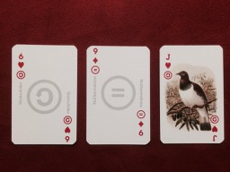

Player A holds: 9-BY, Queen-ND.
 
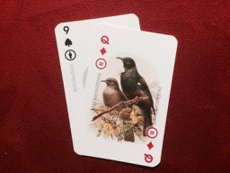

Player B holds: 3-SA, 4-NC.

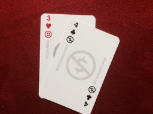

**Discussion starts about the license, many think it should be a Creative Commons Attribution NonCommercial NoDerivatives (CC BY-NC-ND) license.**

Player A decides to keep all their cards because they have a high scoring Attribution and NoDerivatives card.

Player B decides to discard and draw both cards, they get a Queen-NC and 2-BY.

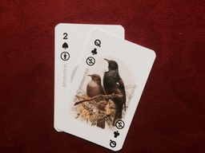

Dealer deals 1 new card to the centre of the table, it’s a King-BY.

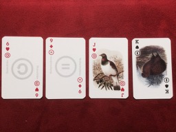

Next turn, Player A decides to discard their 9-BY card (because all players now can use the King-BY for the Attribution part of the license). They draw a Ace-SA.

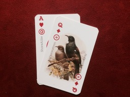

player B decides to also discard and draw 1 new card for the same reason (they discard the 2BY but keep the QNC). They draw an Ace-ND.

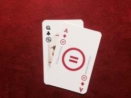

Dealer deals 1 final card to the centre of the table.
It’s a King-NC!

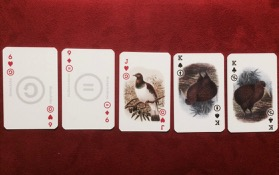

Last turn, Player A discards no cards, they think they have a pretty good hand to play.

Player B decides to discard their Queen-NC (because there is a King-NC they can use on the table), they draw an Ace-NC!

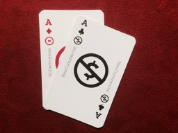

**The dealer reveals that the best license in this scenario is indeed the CC BY-NC-ND**.

**Both players now show the license they can make to each other.**

Player A: King-BY, King-NC (both from the table cards) and Queen-ND (in their hand). 30 points.

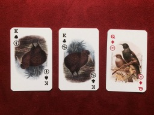

Player B: King-BY (from the table cards), Ace-NC and Ace-ND (both from their hand). 50 points!

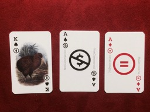

Player B wins that round.
